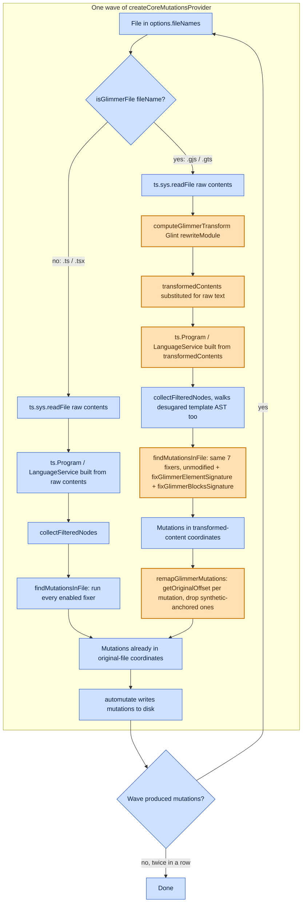

# Program Flow: Normal vs. Glimmer-Patched

**Date:** 2026-08-05
**Scope:** one wave of `createCoreMutationsProvider` (`src/runtime/providers/createCoreMutationsProvider.ts`),
contrasting the pre-existing `.ts`/`.tsx` flow (blue) against the `.gjs`/`.gts` flow this
branch added on top of it (orange). See
[`docs/research/2026-08-04-type-errors-report.md`](../research/2026-08-04-type-errors-report.md)
for the diagnostic-code-delegation-vs-direct-inference distinction referenced inside the
fixer-execution step below.

## Reading this diagram

- **Blue** is every box that existed before this branch: raw-file reads, `ts.Program`
  construction, `collectFilteredNodes`, the fixer-execution step, and `automutate` writing
  mutations to disk. None of this was modified for Glimmer support -- the seven pre-existing
  fixers run exactly as they did before, just against whatever AST the program hands them.
- **Orange** is everything this branch added: the `isGlimmerFile` branch itself, Glint's
  `rewriteModule` transform, content substitution in `createLanguageServices`
  (`src/services/language.ts`), the two new Signature fixers, and `remapGlimmerMutations`
  (`src/runtime/remapGlimmerMutations.ts`).
- The two flows **rejoin** at `automutate writes mutations to disk` -- by the time a mutation
  reaches that step, it's always in original-file coordinates, whether or not it passed
  through the Glimmer branch.
- The Glimmer flow's fixer-execution step (`H2`) is orange only because it _also_ runs two new
  fixers; the seven inherited fixers inside it are unmodified. This is the one node in the
  diagram that's genuinely mixed rather than purely new -- called out explicitly since the
  diagram's two-color scheme can't otherwise represent it.
